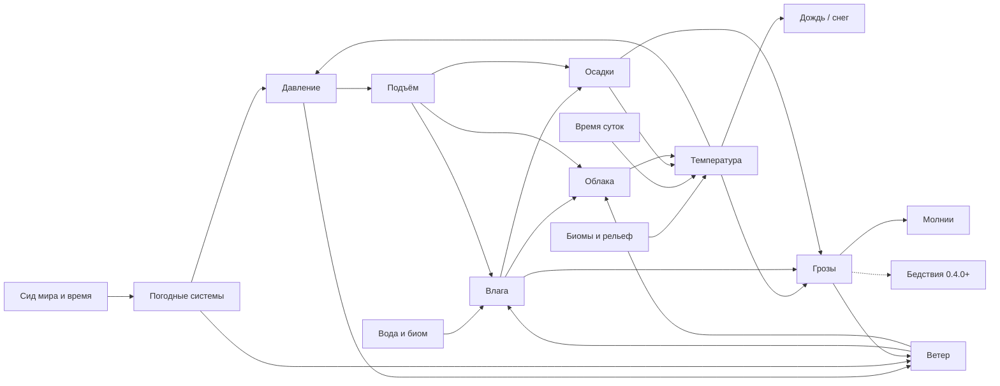

# Climora: дизайн-документ

> Статус: **0.1.0 «Климатические зоны»**. Что уже реализовано, помечено ✅. Что запланировано, помечено 🕓 с версией из [ROADMAP.md](../ROADMAP.md).
>
> Последнее обновление: 2026-09-17.

---

## 1. Принципы

1. **Сервер считает, клиент рисует.** Вся симуляция идёт на сервере. Клиент получает погоду вокруг игрока и только отображает её.
2. **Явления вырастают друг из друга.** Погодные системы дают давление, давление даёт ветер и подъём воздуха, подъём собирает влагу в облака, облака дают осадки, тёплый влажный подъём даёт грозы. Никакое явление не включается «само по себе».
3. **Производительность прежде всего.** Симуляция живёт в жёстком бюджете времени на тик и никогда не загружает и не генерирует чанки.
4. **Сохранения не ломаются.** У формата данных есть версия, и для каждого изменения формата есть путь обновления.
5. **Всё настраивается.** Главные параметры вынесены в конфиг ([CONFIG.md](CONFIG.md)).

---

## 2. Термины

| Термин | Значение |
|---|---|
| **Ячейка** | Квадрат 8×8 чанков (128×128 блоков) с общим состоянием атмосферы |
| **Сетка** | Все ячейки одного измерения |
| **Активная ячейка** | Ячейка рядом с игроком, которая сейчас симулируется |
| **Базовые значения** | Постоянные свойства ячейки, взятые из биомов и рельефа при её создании |
| **Погодная система** | Зона высокого или низкого давления размером в пару километров, дрейфующая по миру |
| **Подъём (lift)** | Насколько поднимается воздух: 0 в антициклоне, 1 в глубоком циклоне |
| **Принудительная погода** | Погода, заданная командой в области ячеек на время |

---

## 3. Архитектура

```
Climora.init()
 ├─ ClimoraConfig            — config/climora.json и climora-client.json
 ├─ ClimoraRegistries        — блок флюгера, предмет, блок-сущность
 ├─ ClimateManager             — по одной симуляции на измерение
 │   └─ ClimateSimulation      — планировщик, модель ячейки, WeatherView для сервера
 │       ├─ ClimateGrid        — хранилище ячеек, SavedData, версия формата
 │       │   └─ ClimateCell    — состояние одной ячейки
 │       ├─ SynopticField      — движущиеся погодные системы (шум от сида мира)
 │       ├─ BiomeClimateSampler — создание ячейки по биомам и рельефу
 │       ├─ ClimateModel, AtmosphereModel — чистые формулы без Minecraft
 │       ├─ ClimateInterpolation — плавные значения между центрами ячеек
 │       ├─ WeatherOverride    — принудительная погода
 │       ├─ LightningSpawner   — локальные молнии
 │       └─ SimulationStats    — статистика производительности
 ├─ LocalWeather               — точка входа для миксинов: идёт ли дождь здесь и какой
 ├─ LocalWeatherSync           — сервер → клиент: погода вокруг игрока раз в секунду
 ├─ ClimateDebugSync           — сервер → клиент: данные для F3 по подписке
 ├─ ClimoraCommand           — /climora ...
 ├─ PlatformClimate            — данные, которые загрузчики отдают по-разному (@ExpectPlatform)
 └─ ClimoraClient            — только клиент
     ├─ ClientWeather          — погода от сервера, WeatherView и SkyWeather для клиента
     ├─ PrecipitationRenderer  — дождь и снег по колонкам
     ├─ CloudRenderer          — облака из облачности
     ├─ WeatherVaneRenderer    — стрелка флюгера
     ├─ ClimateDebugOverlay    — строки F3
     └─ DevHarness             — автоматический сценарий для разработки
```

Код лежит в `common/src/main/java/net/krona/climora/`. Платформенные модули (`fabric`, `neoforge`) вызывают `Climora.init()` и содержат `PlatformClimateImpl`.

**Какие измерения симулируются.** Те, где есть небо: `hasSkyLight && !hasCeiling`. Это Верхний мир и похожие модовые измерения. Незер и Энд получат свою атмосферу позже (🕓 1.7).

**Поток выполнения.** Симуляция идёт в серверном потоке, в конце тика каждого измерения. Перенос в отдельный поток запланирован на 🕓 0.8.1. Поэтому `ClimateModel`, `AtmosphereModel` и `SynopticField` не зависят от Minecraft и покрыты юнит-тестами.

**`WeatherView`.** Общий интерфейс «какая погода в точке» (осадки, гроза, температура, ветер). На сервере его реализует `ClimateSimulation`, на клиенте — `ClientWeather`. Миксины и блоки работают через него и не знают, на какой они стороне.

---

## 4. Сетка ✅

### 4.1 Размер ячейки

**8×8 чанков = 128×128 блоков.** Погодная система (~2 км) занимает около 16 ячеек в поперечнике, при этом игрок видит, как на соседней территории другая погода. Размер записан в сохранении: если его поменять, сетка перестроится (§10).

### 4.2 Координаты

- `cellX = floorDiv(blockX, 128)`, аналогично для Z.
- Ключ ячейки упаковывается в `long` так же, как `ChunkPos`.

### 4.3 Активная зона

- Активны ячейки в квадрате радиусом `activeRadiusCells` (по умолчанию **3**, то есть 7×7 ≈ 900×900 блоков) вокруг каждого игрока. Такой радиус нужен, чтобы облака были видны до горизонта.
- Список пересобирается раз в секунду. Недостающие ячейки строятся **по кольцам**, от игрока наружу.

### 4.4 Создание ячейки

Ячейка строится по 5 точкам: центр и четыре точки на ¼ размера ячейки по диагоналям. Для каждой точки:

1. **Высота поверхности:** из карты высот, если чанк загружен. Иначе генератор мира вычисляет высоту центра ячейки (без создания чанка) — **один раз на ячейку**, это самая дорогая операция (~1 мс).
2. **Биом на поверхности:** `getNoiseBiome` на этой высоте.
3. Из биома берутся его **климат-профиль** (§5.1) и признак воды (теги `is_ocean`, `is_deep_ocean`, `is_river`).

Базовые значения — средние по пяти точкам: температура профиля на высоте точки, суточный размах, влажность, **доля воды** и высота.

> `downfall` нужен только для биомов без профиля. Он закрыт в Minecraft и читается через `PlatformClimate.biomeDownfall()`:
> - **Fabric:** поле `Biome.climateSettings` открыто через `fabric/src/main/resources/climora.accesswidener`.
> - **NeoForge:** `Biome.getModifiedClimateSettings()`. Открывать поле здесь **нельзя**: коремод NeoForge роняет игру, если поле не `private`.

Ячейки из старых сохранений без высоты, доли воды или суточного размаха проходят выборку заново при активации; их погода при этом сохраняется. Команда `/climora resample` ставит ячейки в ту же очередь вручную — например, после `/fillbiome`.

---

## 5. Температура ✅

Формулы в `ClimateModel`.

### 5.1 Профили климата биомов (0.1.0)

У каждого ванильного биома Верхнего мира есть профиль в `ClimateProfiles`:

| Поле | Значение |
|---|---|
| `meanTemperature` | Средняя за сутки температура воздуха, °C |
| `diurnalAmplitude` | Половина размаха день/ночь, °C |
| `humidity` | Насколько влажным стремится быть воздух над биомом, 0..1 |
| `referenceElevation` | Высота, на которой задана средняя температура |

| Биом | Средняя | Размах | Влажность | Высота |
|---|---|---|---|---|
| Джунгли | 26 °C | ±5 | 0.90 | 63 |
| Пустыня | 30 °C | ±16 | 0.05 | 63 |
| Саванна | 27 °C | ±12 | 0.30 | 63 |
| Равнина | 14 °C | ±10 | 0.45 | 63 |
| Тайга | 5 °C | ±10 | 0.60 | 63 |
| Заснеженная равнина | −8 °C | ±10 | 0.50 | 63 |
| Ледяные пики | −14 °C | ±7 | 0.55 | 220 |
| Тёплый океан | 27 °C | ±2 | 0.85 | 63 |
| Замёрзший океан | −4 °C | ±3 | 0.65 | 63 |

**Зачем нужна `referenceElevation`.** Горные биомы холодные в том числе потому, что они высоко. Если задать их температуру на уровне моря и потом ещё вычесть градиент высоты, вершины окажутся вдвое холоднее. Поэтому у горных биомов температура задана на горной высоте, а градиент отсчитывается от неё:

$$T_{profile}(h) = T_{mean} + \Gamma \cdot (h_{ref} - h)$$

**Биомы из других модов** пока используют прежнее отображение $-2 + 20 \cdot t_{biome}$ с размахом по `downfall`. Профили по тегам биомов появятся в 🕓 0.5.0.

### 5.2 Средняя за сутки температура ячейки

Каждая из пяти точек выборки берёт профиль своего биома **на своей высоте**, поэтому ячейка на склоне холоднее ячейки в долине:

$$T_{base} = \frac{1}{5}\sum_i T_{profile,i}(h_i), \qquad T_{mean} = T_{base} - 3 \cdot P$$

- $\Gamma = 0.03$ °C/блок — игровой градиент высоты (реальный 0.0065 °C/м, но горы Minecraft в ~5 раз ниже).
- $P$ — интенсивность осадков 0..1: дождь охлаждает воздух до 3 °C.

### 5.3 Суточный ход

$$\Delta T_{day} = A \cdot \cos\left(2\pi \cdot \frac{(t_{day} - 9000) \bmod 24000}{24000}\right) \cdot (1 - 0.6 \cdot C)$$

$A$ — размах из профиля биома: в пустыне ±16 °C, над океаном ±2 °C. Максимум около 15:00. Облачность $C$ гасит до 60% размаха: пасмурные дни прохладнее, ночи теплее.

### 5.4 Соседи и инерция

$$T_{target} = (1 - 0.3) \cdot (T_{mean} + \Delta T_{day}) + 0.3 \cdot \bar{T}_{neighbours}$$

$$T_{new} = T + (T_{target} - T) \cdot \left(1 - e^{-\Delta t / \tau}\right), \quad \tau = 2400 \text{ тиков}$$

Экспоненциальное приближение точно для шага любой длины: неактивная неделю ячейка догоняет реальность за одно обновление. Тот же приём используется для влаги, облаков, осадков и гроз.

### 5.5 Температура в точке

Температура и высота поверхности интерполируются билинейно между центрами четырёх ближайших ячеек, затем добавляется поправка на высоту точки:

$$T(x, y, z) = T_s(x, z) - \Gamma \cdot (y - h_s(x, z))$$

---

## 6. Атмосфера ✅ (0.0.2–0.0.5)

Формулы в `AtmosphereModel` и `SynopticField`, шаг ячейки — в `ClimateSimulation.updateCell`.

### 6.1 Погодные системы

Давление на уровне моря задаёт поле шума, которое **зависит только от позиции, времени и сида мира**. Ему не нужно сохранённое состояние, оно одинаково для активных и неактивных ячеек и покрывает бесконечный мир.

$$p_{syn}(x, z, t) = 1013 + 22 \cdot \text{clamp}\left(\frac{n_1 + 0.5 \cdot n_2}{1.1}\right)$$

- $n_1, n_2$ — градиентный шум с масштабом 2048 и 1024 блоков по сдвинутым координатам $(x - o_x(t), z - o_z(t))$ и медленным временем $t / 48000$.
- **Дрейф** $o(t)$: преобладающее направление (случайное для каждого мира) со скоростью 0.08 блока/тик (система проходит над игроком примерно за игровые сутки) плюс поперечное покачивание ±600 блоков с периодом 3 игровых дня. Покачивание медленнее дрейфа, поэтому системы никогда не идут назад.

### 6.2 Давление ячейки и подъём

$$p = p_{syn} - 1.2 \cdot (T - \bar{T}_{neighbours})$$

Ячейка теплее соседей — давление ниже (нагретый воздух поднимается). Подъём:

$$L = \text{smoothstep}(1016, 998, p)$$

$L = 0$ при $p \ge 1016$ гПа (антициклон), $L = 1$ при $p \le 998$ гПа (глубокий циклон).

### 6.3 Ветер

$$\vec{v} = \left(0.8 \cdot \vec{v}_{steer} - 300 \cdot \nabla p\right) \cdot (1 + 0.8 \cdot S), \quad |\vec{v}| \le 32 \text{ м/с}$$

- $\vec{v}_{steer}$ — скорость дрейфа погодных систем в м/с (0.08 блока/тик ≈ 4 м/с).
- $\nabla p$ — градиент давления конечными разностями по соседним ячейкам (гПа/блок). Если сосед давно не обновлялся, берётся $p_{syn}$ в его центре.
- $S$ — сила грозы: порывы.
- Сила Кориолиса появится в 2.0 вместе с широтами.

Выше над землёй ветер сильнее: $v(h) = v \cdot (1 + 0.5 \cdot \min(1, h/100))$.

### 6.4 Влага

Влага хранится как массовая доля пара $q$ (г/кг). Насыщение по формуле Магнуса:

$$e_s(T) = 6.112 \cdot \exp\left(\frac{17.67 \cdot T}{T + 243.5}\right), \qquad q_s(T, p) = \frac{622 \cdot e_s}{p - e_s}$$

Равновесная относительная влажность, к которой стремится испарение:

$$RH_{eq} = 0.35 + 0.6 \cdot h_{biome} + 0.15 \cdot W + 0.35 \cdot L + b$$

$W$ — доля воды в ячейке, $b$ — `humidityBias` из конфига. Шаг:

1. **Перенос.** Влага и облачность берутся с наветренной стороны: из точки $x - \vec{v} \cdot 0.02 \cdot \Delta t$ (сдвиг не больше одной ячейки).
2. **Испарение:** $q \to RH_{eq} \cdot q_s(T_{mean}, p)$ с $\tau = 6000$ тиков.
3. **Осадки сушат воздух:** $q \mathrel{*}= e^{-\Delta t \cdot P / 20000}$.

**Две влажности.** Облака и осадки зависят от влажности **столба** $RH_{col} = q / q_s(T_{mean})$ — по средней температуре, а не по ночному охлаждению у земли. Иначе каждую ночь шёл бы дождь. У земли $RH = \min(1, q / q_s(T))$: избыток ночью уходит в росу (туман — 🕓 0.2.0).

### 6.5 Облака и осадки

$$C_{target} = \text{smoothstep}(0.55, 0.92, RH_{col}) \cdot (0.25 + 0.75 \cdot L)$$

$$P_{target} = \text{smoothstep}(0.8, 1.0, RH_{col}) \cdot \text{smoothstep}(0.25, 0.7, L)$$

Облачность стремится к цели за $\tau = 1200$ тиков, осадки за $\tau = 600$.

После релаксации облачность подтягивается под идущий дождь:

$$C = \max\left(C,\ \min\left(1,\ \frac{P}{0.08}\right)\right)$$

Это не косметика. $C$ и $P$ — независимые поля с разными временами отклика, и $P_{target}$ включается при $RH_{col} \ge 0.8$, где $C_{target}$ ещё может быть около 0.35. Клиент рисует облачной ту долю плиток, которая равна $C$, поэтому без этой связки ячейка поливала сквозь наполовину пустое небо и игрок видел дождь из голубой прорехи. Порог 0.08 — та же величина, при которой осадки начинают рисоваться (§6.6): первая капля и сплошная облачность приходят вместе.

Одной поячеечной связки мало. Облачность и осадки сглаживаются между ячейками по отдельности, а $\min(1, P/0.08)$ вогнута, поэтому на границе ливня и ясного неба сглаженная облачность падает быстрее, чем сглаженный дождь. То же правило поэтому применяется второй раз, уже к результату сглаживания: в `ClimateInterpolation.Sample` и в `ClientWeather.cloudCover`.

| Пример | $RH_{col}$ | Результат |
|---|---|---|
| Равнина в глубоком циклоне | ~0.94 | Сплошная облачность, дождь |
| Равнина в антициклоне | ~0.59 | Ясно или редкие облака |
| Пустыня в глубоком циклоне | ~0.70 | Облака, но без дождя |
| Джунгли в антициклоне | ~0.89 | Облачно, без дождя |
| Джунгли в слабом циклоне | ~1.0 | Дождь |

Дождь сам себя ограничивает: осадки сушат воздух, влажность падает, дождь слабеет, пока испарение и новая погодная система не принесут влагу. Это даёт чередование ливней и затиший.

### 6.6 Тип осадков

По температуре воздуха в точке: **снег** при $T \le 0$ °C, **мокрый снег** от 0 до 2 °C (пока рисуется как дождь, 🕓 0.2.0), **дождь** выше. Осадки меньше 0.08 не выпадают и не рисуются.

### 6.7 Снег, лёд и таяние (0.1.0)

Ванильные правила заменены температурными (`LocalWeather`):

| Событие | Наше условие | Ванильное правило |
|---|---|---|
| Снег копится слоями | Идут осадки и воздух ≤ 0 °C | Температура биома и глобальный дождь |
| Вода замерзает по краям | Воздух ≤ −1 °C, освещённость блоков < 10 | Температура биома |
| Снег тает | Воздух > +1 °C | Яркий свет: в тени снег лежал вечно |
| Лёд тает в воду | Воздух > +2 °C | Яркий свет |

Между таянием и замерзанием оставлен зазор в 1–2 °C, чтобы блоки не мигали. Плотный лёд и снежные блоки не тают, как и в ванилле. Все три механики отключаются в конфиге.

Смена биома командой `/fillbiome` сама по себе климат не меняет: нужно пересобрать ячейки командой `/climora resample`.

### 6.8 Грозы и молнии

$$S_{target} = \text{smoothstep}(12, 26, T) \cdot \text{smoothstep}(0.85, 1.0, RH_{col}) \cdot \text{smoothstep}(0.35, 0.8, P) \cdot \text{smoothstep}(0.3, 0.9, \max(L, 0.8 \cdot H))$$

Нужны тепло, очень влажный воздух, уже идущий дождь и подъём — от циклона ($L$) или от дневного прогрева ($H$ — доля текущего суточного максимума). $\tau = 900$ тиков.

**Молнии** (`LightningSpawner`): каждый тик для каждой активной ячейки с $S > 0.15$ шанс удара $S^2 \cdot \text{lightningRate} / 240$ — при полной грозе примерно раз в 12 секунд на ячейку. Место удара случайное в ячейке, только в тикающих чанках и только там, где идут осадки и видно небо. Цель выбирается как в ванилле: громоотвод в радиусе 128 блоков, иначе живое существо под открытым небом, иначе земля.

### 6.9 Принудительная погода

`/climora weather <режим> [радиус] [секунды]` задаёт цели напрямую и ускоряет отклик до $\tau = 100$ тиков:

| Режим | Подъём | Облака | Осадки | Гроза | Влага (от насыщения) |
|---|---|---|---|---|---|
| `clear` | 0 | 0 | 0 | 0 | не выше 0.5 |
| `cloudy` | 0.3 | 0.7 | 0 | 0 | не ниже 0.85 |
| `rain` | 1 | 1 | 0.75 | 0 | не ниже 1.02 |
| `storm` | 1 | 1 | 1 | 1 | не ниже 1.02 |

Влага подтягивается к нужной, поэтому после окончания (`auto` или по времени) погода продолжается естественно. Ванильная `/weather` создаёт такую же погоду в радиусе 32 ячеек (~4 км).

---

## 7. Встраивание в Minecraft ✅

| Миксин | Что меняет | Сторона |
|---|---|---|
| `ServerLevelMixin.advanceWeatherCycle` | Выключает глобальный погодный цикл; мир, сохранённый во время ванильного дождя, один раз «высыхает» для всех | Сервер |
| `ServerLevelMixin.tickPrecipitation` | Снег, лёд, котлы и таяние — по локальной погоде и нашей температуре (§6.7) | Сервер |
| `LevelMixin.isRainingAt` | Локальный дождь для мокрых мобов, огня, фермерских угодий, эндерменов и т.д. | Обе |
| `LevelMixin.getRainLevel / getThunderLevel` | Темнота неба, туман и звуки по погоде у камеры | Клиент |
| `LevelRendererMixin.renderSnowAndRain / tickRain` | Свой рендер дождя и снега, брызги и звук | Клиент |
| `LevelRendererMixin.renderClouds` | Свои облака | Клиент |
| `WeatherCommandMixin` | `/weather` включает локальную погоду | Сервер |

Все замены включаются, только пока локальная погода активна (`localWeather` в конфиге и данные от сервера на клиенте). Иначе работает ванильный код. Обёртки `tickPrecipitation` сделаны через MixinExtras `@WrapOperation`, который есть и в Fabric, и в NeoForge.

**Известные ограничения ванильных механик:** глобальный `isRaining()` на сервере всегда `false`, поэтому пчёлы, жители и рыбалка ведут себя как в ясную погоду; сон в грозу недоступен. Будет исправлено в 🕓 0.2.x.

---

## 8. Клиент ✅

### 8.1 Синхронизация (0.0.4)

`climora:local_weather`, сервер → клиент, **раз в секунду каждому игроку**: погода 7×7 ячеек вокруг него.

| Поле | Размер |
|---|---|
| Игровое время, координаты угла, размер | ~12 байт |
| Смещение дрейфа (double ×2), скорость дрейфа (float ×2) | 24 байта |
| На ячейку: температура (×10), высота, влажность, облака, осадки, гроза, ветер X/Z (по байту) | ~10 байт |

Итого ~520 байт в секунду на игрока. Клиент плавно приближается к новым значениям (10% за тик, ~1 секунда) и интерполирует между центрами ячеек. Пакет с размером 0 возвращает ванильную погоду. Без пакетов 5 секунд клиент тоже возвращается к ванилле.

**Пауза.** Таймаут считается по настенным часам, а `Minecraft.tick()` продолжает идти на паузе — крутится только мир. На паузе в одиночной игре встроенный сервер замирает и пакеты не идут, поэтому через 5 секунд связь выглядела оборванной: небо сваливалось в ванильные облака, а при снятии паузы мод возвращался. Поэтому и `ClientWeather.tick`, и `ClimateDebugOverlay.tick` на `minecraft.isPaused()` выходят сразу, подвинув отметку времени вперёд — иначе таймаут сработал бы на первом же тике после паузы. В сетевой игре `isPaused()` всегда `false`, так что на настоящий обрыв связи это не влияет. Проверяется шагом `pause` в сценарии (§11.3).

### 8.2 Дождь и снег (0.0.2–0.0.3)

`PrecipitationRenderer` повторяет ванильный проход погоды, но:

- **каждая колонка** проверяет свои осадки: у дождя есть края, а слабый дождь прозрачнее;
- **дождь или снег** — по температуре воздуха над колонкой;
- **наклон по ветру:** верх полосы смещается против ветра на $v / 9$ блока на блок высоты для дождя (не больше 0.6) и $v / 6$ для снега (не больше 1.0);
- брызги и звук дождя — только там, где идёт дождь, а не снег.

Как и в ванилле, осадки рисуются в радиусе 10 колонок (5 на «быстрой» графике). Дождевые «стены» вдалеке появятся в 🕓 2.0.

### 8.3 Облака (0.0.4)

`CloudRenderer` заменяет ванильные облака на блочные той же формы (плитки 12×12 блоков):

- **Покрытие:** плитка облачная, если фиксированный шум для плитки меньше облачности в её точке. При росте облачности небо заполняется постепенно. Облачность берётся раз в 4 плитки (48 блоков): она всё равно меняется на масштабе сотен блоков.
- **Шум покрытия** — три октавы с периодами 14, 5 и 2 плитки. Самая широкая октава главная, мелкие только треплют края: иначе вместо облачных банок получается рассыпанная по небу «крупа».
- **Движение:** узор сдвигается на смещение дрейфа погодных систем, которое присылает сервер, поэтому все игроки видят одни и те же облака.
- **Форма:** толщина $4 + (10 \cdot P + 40 \cdot S) \cdot k$ блоков, где $k$ растёт к центру облака; дождевые облака опущены на $12 \cdot P$ блоков. Грозовые облака — высокие башни. Высота макушки гуляет на ±2 блока по отдельному шуму с периодом 20 плиток, поэтому верх поднимается и опускается целыми грядами, а не пляшет от плитки к плитке.
- **Край области.** Облака растворяются на внешней шестой части радиуса, а дальше их скрывает туман, поэтому нет резкой круглой границы над головой.
- **Дальность** по умолчанию следует за дальностью прорисовки игры: `renderDistance × 16 + 320`, от 512 до 1024 блоков. В конфиге можно задать своё число.
- **Цвет.** Берётся ванильный цвет облаков (он уже темнеет в дождь и краснеет на закате), макушки чуть светлее, низ и бока уходят в синеву. Своё затемнение в дождь и грозу — не больше 25%: иначе небо превращается в чёрную крышку.
- **Сетка** перестраивается раз в секунду или при сдвиге на плитку. Грани между соседними облаками не рисуются.
- Рисуется через ванильный `RenderType.clouds()` с белой текстурой **в два прохода, как в ванилле**: первый пишет только глубину (`colorMask` выключен), второй рисует цвет. Без первого прохода полупрозрачные грани складываются, и сквозь облако видно каждую его внутреннюю стенку. Непрозрачность плитки поэтому поднята с ванильных 0.8 до 0.92: одна грань вместо нескольких слоёв иначе слишком сильно просвечивает небом.

### 8.4 Флюгер (0.0.3)

- **Модель:** столб — обычная модель блока, стрелка — `ModelPart`, которую вращает `WeatherVaneRenderer`.
- **Анимация (клиент):** стрелка — затухающая пружина, притягиваемая к направлению, **откуда** дует ветер. Жёсткость растёт с силой ветра, порывы добавляют случайные толчки.
- **Компаратор (сервер):** раз в секунду сила ветра на высоте флюгера переводится в баллы Бофорта (0–12) и затем в сигнал 0–15.
- **Рецепт:** `CCC / _I_ / _C_` — 4 медных слитка и железный слиток.

---

## 9. Планировщик и бюджет ✅

Каждый тик измерения:

1. **Пересборка активной зоны** раз в 20 тиков; устаревшая принудительная погода удаляется.
2. **Выборка ячеек:** не больше `maxCellSamplesPerTick` (1) за тик.
3. **Обновление по кругу:** `ceil(активных / 40)` ячеек за тик, каждая не реже раза в 2 секунды.
4. **Бюджет** `tickBudgetMillis` (1 мс). Если время вышло, обновления переносятся. Выборка ячейки может превысить бюджет — это считается в статистике.
5. **Молнии** для грозовых ячеек.

### Замеры (сценарий разработчика, Fabric, 1 игрок, 49 ячеек)

| Показатель | Значение |
|---|---|
| Среднее время тика | 0.012–0.019 мс |
| Максимум без выборки новых ячеек | 0.05–0.13 мс |
| Пик при выборке ячейки в незагруженных чанках | до 7 мс до оптимизации 0.0.5, после — один вызов генератора на ячейку |

### Память

| | Оценка |
|---|---|
| Одна ячейка в памяти | ~80 байт объект + ~20 байт в хеш-таблице |
| Одна ячейка на диске | 48 байт до сжатия |
| 100 000 ячеек (≈ 40×40 км исследованного мира) | ~10 МБ в памяти, ~4.8 МБ файл до gzip |

Все посещённые ячейки хранятся в памяти. Выгрузка дальних ячеек — 🕓 0.8.1.

---

## 10. Формат данных ✅

### 10.1 Файл

`<мир>/<измерение>/data/climora_climate.dat` (стандартный `SavedData`, gzip NBT).

### 10.2 Версия 4 (текущая, с 0.1.0)

| Тег | Тип | Значение | С версии |
|---|---|---|---|
| `DataVersion` | int | Версия формата, сейчас **4** | 1 |
| `CellSizeChunks` | int | Размер ячейки в чанках, **8** | 1 |
| `Keys` | long[] | Упакованные координаты ячеек | 1 |
| `LastUpdate` | long[] | Игровое время последнего обновления | 1 |
| `BaseTemperature` | int[] | Среднесуточная температура ячейки на её высоте, °C | 1 |
| `BaseAmplitude` | int[] | Половина суточного размаха, °C (NaN — неизвестен) | 4 |
| `BaseHumidity` | int[] | Влажность из профиля биома, 0..1 | 1 |
| `WaterFraction` | int[] | Доля воды, 0..1 (NaN — неизвестна) | 3 |
| `Elevation` | int[] | Средняя высота, Y (`Integer.MIN_VALUE` — неизвестна) | 2 |
| `Temperature` | int[] | Температура воздуха, °C | 1 |
| `Moisture` | int[] | Пар, г/кг (NaN — неизвестен) | 3 |
| `CloudCover` | int[] | Облачность, 0..1 | 3 |
| `Precipitation` | int[] | Осадки, 0..1 | 3 |
| `Storm` | int[] | Гроза, 0..1 | 3 |

Ячейки хранятся **по столбцам**; float — как `Float.floatToIntBits`. Давление, влажность у земли и ветер не сохраняются: они пересчитываются при первом обновлении.

**История версий:**

| Версия | Мод | Изменение | Обновление |
|---|---|---|---|
| 1 | фаза 0 | Первый формат | — |
| 2 | 0.0.1 | `Elevation` | `upgradeFrom1`: высота «неизвестна», повторная выборка |
| 3 | 0.0.2 | `WaterFraction`, `Moisture`, `CloudCover`, `Precipitation`, `Storm` | `upgradeFrom2`: доля воды и влага «неизвестны», ясное небо; влага стартует с равновесной |
| 4 | 0.1.0 | `BaseAmplitude`; `BaseTemperature` теперь из профиля биома и включает высоту | `upgradeFrom3`: размах «неизвестен», ячейки пересобираются при активации |

### 10.3 Правила загрузки

| Ситуация | Поведение |
|---|---|
| `DataVersion` больше поддерживаемой | Симуляция выключается, данные сохраняются обратно без изменений |
| `DataVersion` меньше текущей | Цепочка `upgrade()`: 1→2, 2→3, … |
| `DataVersion` нет или 0 | Сетка начинается с нуля |
| Другой `CellSizeChunks` | Сетка перестраивается |
| Массивы разной длины | Данные повреждены: сетка перестраивается |

### 10.4 Как менять формат

1. Увеличить `ClimateGrid.DATA_VERSION`.
2. Добавить в `ClimateGrid.upgrade()` шаг `case <старая версия> -> ...`.
3. Обновить таблицы в §10.2 и добавить тест в `ClimateGridTest`.

---

## 11. Отладка ✅

### 11.1 Команды (уровень прав 2)

| Команда | Что делает |
|---|---|
| `/climora temperature [pos]` | Температура, осадки, давление, влажность, облачность и ветер в точке |
| `/climora cell [pos]` | Полное состояние ячейки, включая влагу, подъём и принудительную погоду |
| `/climora weather clear\|cloudy\|rain\|storm [радиус] [секунды]` | Принудительная погода вокруг (по умолчанию радиус 3, 600 с) |
| `/climora weather auto` | Снять принудительную погоду здесь |
| `/climora stats` | Ячейки, время тика, обновления, молнии |
| `/climora resample [радиус]` | Пересобрать ячейки по местности, например после `/fillbiome` |
| `/climora stress <радиус>` | Дополнительные ячейки вокруг игроков для нагрузочного теста |
| `/climora reload` | Перечитать `config/climora.json` |

### 11.2 Оверлей F3

```
[Climora] Air 9.8 °C (surface Y 66), humidity 100%
Pressure 1013 hPa, clouds 100%, rain 74%
Wind 4.4 m/s from S (Beaufort 3)
Cell -1, 0: 9.6 -> 11.5 °C (biome 14.0 °C), forced rain
Climate sim: 49 active cells, 0.014 ms/tick
```

Данные приходят по подписке: пакет `climora:debug_subscription` при открытии и закрытии F3, ответ `climora:climate_debug` раз в 10 тиков. Правило `reducedDebugInfo` отключает отправку.

### 11.3 Автоматический сценарий

`./gradlew :fabric:runClient -PclimoraHarness=weather` (или `:neoforge:`, или сценарий `snow`) создаёт мир с фиксированным сидом, по шагам включает ясно, облачно, дождь и грозу, ставит флюгер, делает скриншоты в `run/screenshots/climora-*.png`, пишет `/climora stats` и `cell` в лог и закрывает игру. Без свойства ничего не делает.

### 11.4 Запуск из IDE

Конфигурации запуска IntelliJ (`.idea/runConfigurations/Minecraft *.xml`) ссылаются на модули по имени: `climora.fabric.main`, `climora.neoforge.main`. Переименование мода меняет имена модулей, а IDEA молча **выкидывает** ссылку на несуществующий модуль из конфигурации. Конфигурация без модуля запускается с пустым classpath, и игра падает так:

```
Error loading companion plugin class [dev.architectury.plugin.fabric.ArchitecturyMixinPlugin]
  ClassCastException: ... cannot be cast to ... IMixinConfigPlugin
  (ArchitecturyMixinPlugin is in unnamed module of loader 'knot';
   IMixinConfigPlugin is in unnamed module of loader 'app')
```

Дальше не инициализируется MixinExtras, и первым падает чужой миксин — обычно `fabric-block-api-v1` с `Invalid descriptor`. Ошибка выглядит как проблема Fabric API, но мод и Fabric API тут ни при чём: то же самое собирается и запускается через `./gradlew :fabric:runClient`. Лечится правкой имени модуля в конфигурации или пересозданием конфигураций (`./gradlew ideaSyncTask` и Reload Gradle Project).

---

## 12. Как связаны явления



| Величина | Зависит от | Влияет на | Версия |
|---|---|---|---|
| Температура | Профиль биома, высота, время суток, облака, осадки, соседи | Давление, тип осадков, снег и лёд, грозы | ✅ 0.0.1–0.1.0 |
| Давление | Погодные системы, температура соседей | Подъём, ветер | ✅ 0.0.2 |
| Влага | Биом, вода, подъём, ветер, осадки | Облака, осадки, грозы | ✅ 0.0.2–0.0.3 |
| Ветер | Градиент давления, дрейф, грозы | Перенос влаги и облаков, наклон осадков, флюгер | ✅ 0.0.3 |
| Облачность | Влага, подъём, ветер | Суточный ход, облака на небе | ✅ 0.0.2, 0.0.4 |
| Осадки | Влага, подъём | Температура, влага, ванильные механики | ✅ 0.0.2 |
| Грозы | Температура, влага, осадки, подъём, прогрев | Молнии, порывы ветра, облака-башни | ✅ 0.0.5 |
| Туман, град, гололёд | Влага у земли, температура | Видимость, урон, скольжение | 🕓 0.2.0 |
| Бедствия | Ветер, гроза, давление | Разрушения | 🕓 0.4.0+ |
| Сезон | Календарь (1.1), наклон оси (2.0) | Температура | 🕓 1.1 / 2.0 |

---

## 13. Проверка версий

Проверки «в игре» сделаны автоматическим сценарием (§11.3) со скриншотами на Fabric и NeoForge.

| Версия | Критерий | Как проверено | Статус |
|---|---|---|---|
| Фаза 0 | Сетка создаётся, тикает, сохраняется | Тесты `ClimateGridTest`; мир пользователя на NeoForge сохранил `climora_climate.dat` | ✅ |
| 0.0.1 | Высота охлаждает, плавность, F3 | Тесты `ClimateInterpolationTest`, скриншот F3 | ✅ |
| 0.0.2 | Давление, влага, облачность и осадки | Тесты `AtmosphereModelTest`, `SynopticFieldTest`; `/climora cell` в сценарии | ✅ |
| 0.0.2 | Локальный дождь с краями, снег по температуре | Скриншоты «rain», «rain-edge»; снег — только тесты | ✅ / 🕓 снег в игре |
| 0.0.3 | Ветер, наклон дождя, флюгер | Скриншоты «rain», «storm», «weather-vane» | ✅ |
| 0.0.4 | Облака совпадают с облачностью | Скриншоты «clear», «cloudy», «storm» | ✅ |
| 0.0.5 | Грозы и молнии | Сценарий на NeoForge: 11 ударов молнии за ~20 секунд грозы, скриншот «storm» | ✅ |
| 0.0.5 | Конфиг | Файлы создаются при запуске, `/climora reload` | ✅ |
| 0.1.0 | Климат всех ванильных биомов | Тесты `ClimateProfilesTest`; `/climora cell` в тундре и на равнине | ✅ |
| 0.1.0 | Снег копится, вода замерзает, всё тает в тепле | Сценарий `snow` со скриншотами | ✅ |
| 0.0.5 | Производительность | `/climora stats` в сценарии: 0.012–0.019 мс/тик на Fabric и NeoForge | ✅ одиночная игра, 🕓 публичный тест |
| 0.0.5 | Выделенный сервер, несколько игроков, Sodium/Iris | Публичный тест ([TESTING.md](TESTING.md)) | 🕓 |

---

## 14. Переименование из Tempestra

Мод назывался Tempestra до версии 0.1.1. При переименовании сменились id мода, пакеты, команды, файлы настроек и id блока. Чтобы старые миры не пострадали:

| Что | Как переносится |
|---|---|
| Климат мира | При загрузке измерения, если `climora_climate.dat` пуст, данные читаются из `tempestra_climate.dat` и сохраняются уже под новым именем |
| Настройки сервера и клиента | Если нет `climora.json` / `climora-client.json`, читаются `tempestra.json` / `tempestra-client.json` |
| Поставленные флюгеры | **Теряются:** id блока сменился, Minecraft заменяет неизвестные блоки воздухом |

---

## 15. Открытые вопросы

- **Частота дождей.** Параметры §6.4–6.5 подобраны по расчёту, а не по наблюдению за естественной погодой в течение часов игры. Главный вопрос публичного теста.
- **Sodium и Iris.** Sodium может заменять рендер облаков своим; нужна проверка совместимости (🕓 0.2.1).
- **Ванильные механики, завязанные на глобальный `isRaining()`** (пчёлы, жители, рыбалка, сон в грозу) — 🕓 0.2.x.
- **Выгрузка ячеек** из памяти — 🕓 0.8.1.
